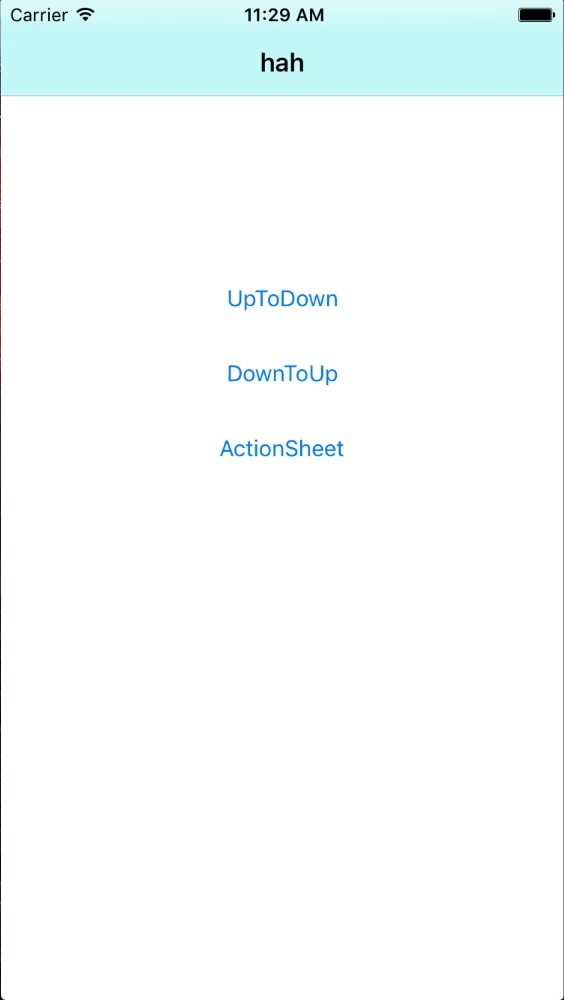

# ASFluctuateView
###简介：
自定义封装的仿actionsheet控件。

### 用法：
初始化方法：（参数类型有注释）

**- (id)initWithFrame:(CGRect)frame type:(XSFluctuateViewType)type isUpToDown:(BOOL)isUpToDown screenCanUsedHeight:(CGFloat)contentHeight;**

__初始化完成记得指定代理__

### 然后实现其代理方法：

**- (void)fluctuateView:(UIView *)fluctuateView content:(UIView *)contentView itemIndex:(NSInteger)index;**

主要用于实现item点击事件

###效果
